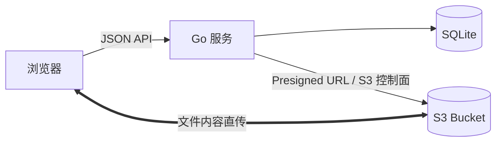

# Cloud

Cloud 是一个轻量、单用户、自托管的私人 S3 网盘。Go 服务主要处理认证、SQLite 文件树元数据和 S3 控制面；普通上传与下载通过短期 Presigned URL 在浏览器和 S3 之间直传。内置编辑器读写不超过 1 MiB 的文本文件时会经过应用服务，以便校验 UTF-8、大小和并发修改。

它不是 Nextcloud 的替代品：没有多用户协作、WebDAV、Office 套件、同步客户端或企业权限系统。

## 架构



- 用户路径与 S3 Object Key 完全解耦。`Photos/cat.png` 在 S3 中类似 `objects/550e8400-...`。
- 移动和重命名只更新 SQLite，不执行 `CopyObject`。
- 上传先写入 `pending` 元数据，服务端 `HeadObject` 验证大小后才切换为 `ready`。
- 删除先切换到 `deleting`；只有 `DeleteObject` 成功后才删除元数据。

## 快速开始（Docker / Podman）

仓库内的 Compose 配置默认拉取已发布的多架构镜像 `ghcr.io/vesperglow/cloud:latest`，同时启动 MinIO，并自动创建私有 Bucket 和开发用 CORS。

```bash
cp .env.example .env
# 至少修改 S3_SECRET_KEY；ADMIN_PASSWORD 留空会自动生成一次性密码
docker compose up -d
docker compose logs cloud
```

打开 <http://localhost:8080>。如果没有配置 `ADMIN_PASSWORD`，首次成功启动时会在 `cloud` 容器日志中打印一次管理员用户名和随机密码；登录后点击右上角头像进入账户设置并立即修改。MinIO 控制台位于 <http://localhost:9001>。

Podman 用户可以运行：

```bash
podman compose up -d
```

也可以直接拉取镜像：

```bash
docker pull ghcr.io/vesperglow/cloud:latest
```

每次 `main` 更新会发布 `latest` 和完整 commit SHA 标签；`v*` Git tag 还会发布对应版本标签。若 GHCR Package 尚未设为 Public，请先登录 GHCR，或在 GitHub Package 设置中将其改为公开。

生产环境应将 `APP_BASE_URL` 改为实际 HTTPS 地址，将 `COOKIE_SECURE=true`，使用高熵密码，并将 Bucket CORS 的来源改为同一个 HTTPS Origin。Compose 自带 MinIO 主要用于单机部署和本地体验；也可以删除 `minio` / `minio-init` 服务并指向已有 S3-compatible 存储。

## 从源码构建

需要 Go 1.25+ 和 Node.js 24+。前端产物会写入 `internal/webui/dist` 并由 `go:embed` 打进二进制。

```bash
cd web
npm ci
npm run build
cd ..
go test ./...
go build -o cloud ./cmd/server
```

从当前源码构建容器并让 Compose 使用本地镜像：

```bash
docker build -t cloud:local .
CLOUD_IMAGE=cloud:local docker compose up -d
```

运行：

```bash
set -a; . ./.env; set +a
./cloud
```

## 配置

| 变量 | 默认值 | 说明 |
|---|---:|---|
| `APP_ADDR` | `:8080` | HTTP 监听地址 |
| `APP_DATA_DIR` | `/data` | SQLite 数据目录 |
| `APP_BASE_URL` | `http://localhost:8080` | 用于同源写请求校验 |
| `COOKIE_SECURE` | 根据 Base URL | 生产必须为 `true`；HTTP 本地开发设为 `false` |
| `ADMIN_USERNAME` | `admin` | 首次初始化使用的管理员用户名 |
| `ADMIN_PASSWORD` | 随机生成 | 可选；设置时至少 12 字符，未设置时首次启动生成一次性密码；只保存 Argon2id hash |
| `S3_ENDPOINT` | AWS 默认 | S3-compatible endpoint；AWS S3 可留空 |
| `S3_PUBLIC_ENDPOINT` | 与 `S3_ENDPOINT` 相同 | 浏览器可访问的签名 URL endpoint；容器内外主机名不同时设置 |
| `S3_REGION` | `us-east-1` | Bucket region |
| `S3_BUCKET` | 无 | Bucket 名称 |
| `S3_ACCESS_KEY` | 无 | 仅后端使用 |
| `S3_SECRET_KEY` | 无 | 仅后端使用 |
| `S3_PATH_STYLE` | `false` | MinIO 等存储通常设为 `true` |
| `PRESIGN_EXPIRES` | `15m` | 上传、下载和预览 URL 有效期 |
| `MULTIPART_THRESHOLD` | `104857600` | Multipart 阈值，默认 100 MiB |
| `PART_SIZE` | `16777216` | 分片大小，最小 5 MiB |
| `UPLOAD_EXPIRES` | `24h` | 未完成上传的清理期限 |

管理员设置只在数据库第一次初始化时读取。之后修改环境变量不会重置已有密码，避免部署配置漂移意外改密。随机密码只在新数据库首次成功启动时打印一次，不会在容器重启时再次显示；可通过右上角头像进入账户设置修改用户名和密码，修改后所有现有会话都会失效。

首次凭据会进入容器日志，任何能够读取日志的人都可能看到它。请在首次登录后立即修改密码，并限制部署平台与日志系统的访问权限；如果不希望凭据出现在日志中，请在首次启动前显式配置 `ADMIN_PASSWORD`。

如果已有数据库的管理员凭据丢失，不要删除数据卷。停止服务后运行一次恢复命令，它会保留文件与元数据、撤销已有会话，并在终端打印新的随机凭据：

```bash
docker compose stop cloud
docker compose run --rm --no-deps cloud reset-admin
docker compose start cloud
```

可在命令末尾指定新用户名，例如 `cloud reset-admin owner`。恢复密码同样只显示一次，登录后请立即从右上角账户设置中修改。账户设置也支持上传、更换和移除个人头像；头像文件保存在同一个私有 S3 Bucket 中，大小限制为 2 MiB。

## S3 权限

应用凭据只需操作指定 Bucket。AWS IAM 策略示例（替换 Bucket 名）：

```json
{
  "Version": "2012-10-17",
  "Statement": [
    {
      "Effect": "Allow",
      "Action": ["s3:ListBucket"],
      "Resource": ["arn:aws:s3:::my-private-cloud"]
    },
    {
      "Effect": "Allow",
      "Action": [
        "s3:GetObject",
        "s3:PutObject",
        "s3:DeleteObject",
        "s3:AbortMultipartUpload",
        "s3:ListMultipartUploadParts"
      ],
      "Resource": ["arn:aws:s3:::my-private-cloud/*"]
    }
  ]
}
```

Bucket 必须保持私有。浏览器访问对象依赖 Presigned URL，而不是公开读取权限。

## Bucket CORS

浏览器直接 PUT/GET S3，因此必须配置 CORS。生产环境不要使用 `AllowedOrigins: ["*"]`，应只允许网盘 Origin：

```json
[
  {
    "AllowedOrigins": ["https://drive.example.com"],
    "AllowedMethods": ["GET", "HEAD", "PUT"],
    "AllowedHeaders": ["*"],
    "ExposeHeaders": ["ETag"],
    "MaxAgeSeconds": 3600
  }
]
```

`ExposeHeaders: ["ETag"]` 是 Multipart 完成所必需的；前端必须读取每个分片响应的 ETag。

## API

除健康检查和登录外，所有 API 都要求 `HttpOnly` Session Cookie。

| 方法 | 路径 | 用途 |
|---|---|---|
| `GET` | `/healthz`、`/readyz` | 存活与 SQLite 就绪检查 |
| `POST` | `/api/auth/login`、`/api/auth/logout` | 登录与注销 |
| `GET` | `/api/auth/me` | 当前管理员 |
| `GET` / `PUT` / `DELETE` | `/api/profile/avatar` | 读取、更新或移除个人头像 |
| `GET` | `/api/storage/stats` | 所有 ready 文件的逻辑总大小与文件数 |
| `GET` | `/api/files/{id}` | 文件/目录与面包屑 |
| `GET` | `/api/files/{id}/children` | 目录内容 |
| `POST` | `/api/directories` | 新建目录 |
| `PATCH` | `/api/files/{id}` | 重命名、移动或同时执行 |
| `DELETE` | `/api/files/{id}` | 删除文件或空目录 |
| `GET` | `/api/files/{id}/download` | 302 到 Presigned 下载 URL |
| `GET` | `/api/files/{id}/preview` | 302 到图片预览 URL |
| `GET` / `PUT` | `/api/files/{id}/content` | 读取或保存可编辑文本文件，含 ETag 冲突保护 |
| `POST` | `/api/documents` | 在指定目录新建 UTF-8 文本文档 |
| `GET` / `POST` / `DELETE` | `/api/files/{id}/share` | 查询、创建/重置或停止公开分享 |
| `GET` | `/s/{token}` | 无需登录，通过稳定分享地址读取文件 |
| `POST` | `/api/uploads` | 创建 Single PUT / Multipart 上传 |
| `GET` | `/api/uploads/{id}/parts` | 分批签发分片 URL，最多 50 个 |
| `POST` | `/api/uploads/{id}/complete` | 服务端完成并 `HeadObject` 验证 |
| `DELETE` | `/api/uploads/{id}` | 取消并清理待上传元数据 |

## 公开分享

文件操作区的“分享”按钮可以创建一个高熵公开链接。链接长期有效，任何持有者无需登录即可访问；重新生成链接会立即废弃旧地址，“停止分享”会撤销当前地址。删除文件时对应分享也会自动删除。

公开入口不会让文件经过应用服务器，而是每次签发一个短期 S3 URL 并返回 302，同时按文件扩展名返回适合的内容类型。分享地址是稳定的原始文件读取地址，因此也能用于任何支持 HTTP URL 的客户端。

分享 URL 等同于访问凭据，请不要发布到公开仓库、聊天群或日志中。若怀疑泄露，请立即重新生成或停止分享。

## 文档编辑器

点击 `.md`、`.markdown`、`.txt`、`.yaml`、`.yml`、`.json`、`.toml`、`.ini`、`.conf`、`.log` 或 `.csv` 文件即可打开编辑器；当前目录也可以直接新建文档。Markdown 支持编辑、分栏和安全过滤后的预览，`Ctrl/⌘ + S` 可保存。

编辑器只接受 UTF-8 且不超过 1 MiB 的文件。保存会覆盖同一个 S3 对象并更新 SQLite 中的大小、MIME 和 ETag；若文件已被其他页面修改，旧编辑会收到 `409 Conflict`，不会静默覆盖新内容。已有公开分享链接无需重建，会读取保存后的最新内容。

## 媒体预览

当前目录中的图片、GIF 和视频会组成一个循环媒体序列，可使用左右按钮或键盘方向键切换。图片与 GIF 使用原始对象地址，GIF 会保留动画；视频使用浏览器原生播放器。音频文件会打开独立的原生播放器。底部下载按钮始终下载原始文件。

应用识别 JPEG、PNG、WebP、GIF、AVIF，以及 MP4、WebM、OGV、MOV、M4V、MP3、WAV、OGG、M4A、AAC、FLAC 等常见扩展名。应用不执行转码，最终能否播放仍取决于文件内部编码和访问浏览器的解码能力；兼容性优先推荐 H.264/AAC 的 MP4、WebM，以及 MP3、WAV 或 OGG 音频。

侧栏显示所有 `ready` 文件的逻辑总大小与文件数。它不代表对象存储供应商的计费占用，不计未完成 Multipart 分片、Bucket 版本历史或供应商额外开销。

## S3 对象与分片

界面中的目录、显示名和层级保存在 SQLite；每个逻辑文件对应一个 `objects/<随机 UUID>` S3 对象。Bucket 控制台看到的 UUID 是不可读的物理对象键，不代表一个文件被拆成了多块。

超过阈值的大文件在上传过程中使用 S3 Multipart 分片并行传输，完成后由 S3 合并成一个对象。本项目没有再做内容级切块或跨文件去重：对单用户网盘而言，这会增加清单一致性、删除回收、下载请求数、分享跳转和灾难恢复的复杂度，却通常没有足够收益。

## 数据模型与一致性

- `files`：文件树、显示名、随机 Object Key、大小、MIME、ETag 和状态；固定 root ID 为 `00000000-0000-0000-0000-000000000000`。
- `uploads`：Single/Multipart 控制状态、预期大小、S3 Upload ID 和过期时间。
- `shares`：文件与高熵公开 token 的一对一映射。
- `sessions`：只保存 Session Token 的 SHA-256 hash，不保存明文 Token。
- `settings`：管理员用户名、Argon2id 密码 hash 和头像媒体类型；头像内容保存在 S3。

SQLite 开启 `foreign_keys`、`busy_timeout` 与 WAL。文件名唯一性由数据库索引保证；目录移动通过 recursive CTE 阻止自环和移动到子孙目录。

启动后每 15 分钟扫描过期上传：Multipart 会先调用 Abort，Single PUT 会尝试删除可能存在的对象，然后清理 `pending` 元数据。应用崩溃无法提供跨 SQLite/S3 的分布式事务；失败状态会保留元数据以避免静默丢失。

## 备份与恢复

文件内容位于 S3，但文件树、名称和目录关系只在 SQLite，**必须同时备份 SQLite 与 S3 Bucket**。

最简单且安全的停机备份：

```bash
docker compose stop cloud
docker run --rm -v cloud_cloud-data:/data -v "$PWD/backups:/backup" alpine \
  cp /data/cloud.db /backup/cloud-$(date +%F).db
docker compose start cloud
```

不停机备份应使用 SQLite Online Backup API 或 `sqlite3 /data/cloud.db ".backup '/backup/cloud.db'"`，不要只复制运行中的 WAL 主文件。恢复时先停止 Cloud，用备份替换 `/data/cloud.db`，确认文件属主可由容器 UID `10001` 读取，再启动服务。S3 对象也必须来自相互匹配的备份时间点。

## 安全设计

- Argon2id 密码 hash（随机盐），`crypto/rand` 生成高熵 Session；数据库只保存 Session hash。
- `HttpOnly`、`SameSite=Lax` Cookie；生产 HTTPS 下强制 `Secure`。
- 写请求 Origin 校验、JSON body 上限、文件名/长度校验、参数化 SQL、登录内存限速。
- Presigned URL 短期有效；日志不记录密码、Cookie、S3 Secret 或完整 Presigned URL。
- 完成上传不信任浏览器状态，必须由后端 `HeadObject` 校验最终大小。
- 容器以非 root UID `10001` 运行。

## 当前限制

- 单用户；不提供注册、WebDAV、OIDC、同步客户端或 Office 文档协作编辑。
- 目录必须为空才能删除，避免递归 S3 删除产生部分成功的数据不一致。
- 媒体直接读取 S3 原始对象；没有服务端缩略图、转码、波形、OCR 或 EXIF 索引，不受浏览器支持的编码无法播放。
- 登录限速是单实例内存状态；这符合单实例 MVP 的部署模型。
- Multipart 不做跨浏览器恢复；取消或过期会清理，网络失败可在当前页面重试。

## 测试

```bash
cd web && npm ci && npm run build && cd ..
go test ./...
go vet ./...
go build ./...
docker build -t cloud:test .
```

测试覆盖登录、Session、Session 过期、密码盐、头像生命周期、媒体预览与空间统计、文本编辑、公开分享、同目录名称冲突、root 保护、目录循环、上传 `pending → ready` 和删除失败保留 `deleting` 元数据。GitHub Actions 会对每次 push / PR 重复执行这些检查。
